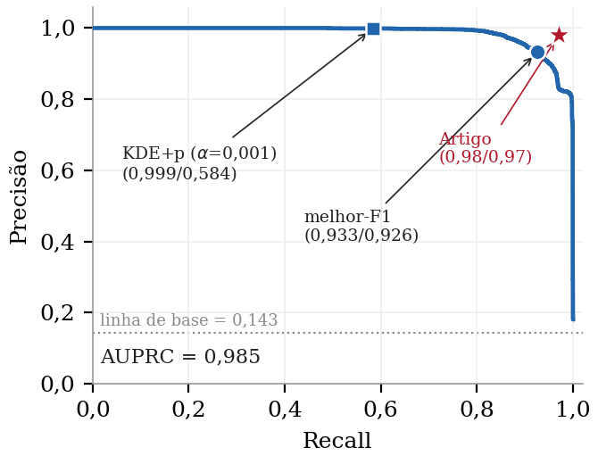

# Resultados de referência (TraceAnomaly, rnvp, testbed TrainTicket)

Saídas de **cinco execuções independentes** da reprodução (`eval_r1.txt` … `eval_r5.txt`),
geradas por `src/evaluate.py` sobre os *scores* de cada execução. Servem para
comparação por quem reproduz.

> **Não-determinístico.** O código original **não fixa *seed***. Não espere números
> idênticos: o critério é **cair na faixa** observada abaixo.

## Métricas por execução

| Execução | AUPRC | melhor-F1 (P / R) | KDE+p α=0,001 — P / R / F1 |
|---|---|---|---|
| 1 | 0,985 | 0,930 (0,933 / 0,926) | 0,999 / 0,584 / 0,737 |
| 2 | 0,971 | 0,916 (0,884 / 0,951) | 0,998 / 0,374 / 0,544 |
| 3 | 0,986 | 0,946 (0,936 / 0,957) | 0,996 / 0,601 / 0,749 |
| 4 | 0,984 | 0,939 (0,959 / 0,919) | 0,997 / 0,512 / 0,676 |
| 5 | 0,952 | 0,924 (0,870 / 0,986) | 0,987 / 0,131 / 0,231 |

## Agregado (N=5) — a "faixa esperada"

| Métrica | média | desvio | mín | máx |
|---|---|---|---|---|
| AUPRC | 0,976 | 0,013 | 0,952 | 0,986 |
| melhor-F1 | 0,931 | 0,011 | 0,916 | 0,946 |
| KDE+p precisão | 0,995 | 0,004 | 0,987 | 0,999 |
| **KDE+p recall** | **0,440** | **0,174** | **0,131** | **0,601** |
| KDE+p F1 | 0,587 | 0,193 | 0,231 | 0,749 |

**Leitura:** o *ranqueamento* (AUPRC) e a *precisão* reproduzem de forma estável; o
**recall no ponto de decisão (α=0,001) é altamente instável** entre execuções, sem
seed — e nenhuma execução alcança o par 0,98/0,97 reportado no artigo. A figura
`pr_curve.png` mostra a curva PR de uma execução representativa com os pontos de
operação marcados.



## Arquivos neste diretório

- `rnvp_testbed_r1.csv` … `rnvp_testbed_r5.csv` — **scores brutos** por *trace* de
  teste (`id,label,score`), uma por execução (35.434 linhas cada);
- `vrnvp_testbed_r1.csv` … `_r5.csv` — scores de validação (normais) que ajustam o KDE;
- `eval_r1.txt` … `eval_r5.txt` — saída de `src/evaluate.py` (métricas) por execução;
- `pr_curve.{pdf,png}` — curva PR de uma execução representativa;
- `AGGREGATE.md` — este resumo.

Para re-derivar as métricas de uma execução a partir dos *scores* brutos:

```bash
python src/evaluate.py reference-results/rnvp_testbed_r1.csv \
    --normal-scores reference-results/vrnvp_testbed_r1.csv --alpha 0.001
```

